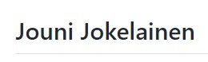

# Forkme repo
Forkkaa tämä repo omaan GitHub repositorioosi. Kloonaa forkattu repo omalle työasemallesi. Luo *Nimet* hakemistoon uusi *etunimi.sukunimi.md* tiedosto (korvaa etunimi.sukunimi omalla nimelläsi). Kirjoita em. tiedostoon sisällöksi oma nimesi. Luo uusi *commit* ja työnnä muutokset tämän jälkeen omaan forkattuun GitHub repositorioosi. Tee tämän jälkeen uusi *Pull Request* alkuperäiseen *RiveriaGit* repositorioon.

HUOM: Käytä *Markdown* muotoilua ja käytä nimeesi otsikkomuotoilua *(Heading level 2)* alla näkyvän kuvan mukaisesti.  

 

